# MediPlan+

## Descripción
MediPlan+ es una plataforma de ecommerce que permite a las personas registrarse y configurar un kit mensual de medicamentos, pagando una suscripción mensual. La plataforma está diseñada para facilitar el acceso a medicamentos esenciales de manera conveniente y personalizada.

## Breve explicación del entorno de desarrollo

Se instaló de forma manual el SDK de flutter versión 3.24.2 desde la página oficial (https://docs.flutter.dev/). Además, se añadió en las variables de entorno del usuario local en PATH la ruta donde está el bin de la carpeta del SDK. Ejm. C:\Users\user\Desktop\flutter\bin.
Se instaló Visual Studio Code versión 1.93 desde la página oficial (https://code.visualstudio.com/). Dentro del IDE, se agregaron las extensiones para Flutter y Dart.
Se instaló la IDE Android Studio Koala desde la página oficial (https://developer.android.com/studio).
Desde Android Studio, en el gestor de dispositivos virtuales, se creó un nuevo dispositivo que funcionará como el emulador. 
Con el comando flutter doctor, se puede obtener un resumen de las configuraciones y verificar si existen errores o advertencias. Se resuelve las advertencias necesarias para el correcto funcionamiento.
Para crear el proyecto, se usó el comando flutter create proyecto; y, desde la carpeta del proyecto, se ejecuta con el comando flutter run.

## Diagrama de despliegue


## Requerimientos no funcionales

- La aplicación será desarrollada en flutter SDK versión 3.24.2.
- La aplicación será diseñada en base a una paleta de colores que incluye los tonos #195742, #1b986e, #4b4b4b, #b5b5b5 y #f9f9f9.
- La aplicación se desplegará en Android.
- La aplicación hará uso del API de Postmark para el envío de correos electrónicos.
- La aplicación será responsive para ser compatible con diferentes tamaños de pantalla y resoluciones en dispositivos Android. 
- La aplicación se desarrollará en Windows.
- El backend será desarrollado en Ruby.
- El backend tendrá acceso a una base de datos sqlite3.
- El sistema manejará errores para proporcionar una buena experiencia de usuario y los límites de las funcionalidades de la aplicación.
- La aplicación será diseñada para ser intuitiva y fácil de navegar.


## Diagrama de casos de uso


```

@startuml
Cliente --> (Crear cuenta)
Cliente --> (Iniciar sesión)
Cliente --> (Recuperar contraseña)
Cliente --> (Ver medicamentos)
Cliente --> (Rastrear pedido)
Cliente --> (Ver mi kit mensual)
Cliente --> (Ver boticas)
(Buscar boticas) .> (Ver boticas) : extends
(Buscar medicamentos) .> (Ver medicamentos) : extends
(Filtrar medicamentos) .> (Ver medicamentos) : extends
(Ver detalles de medicamento) .> (Ver medicamentos) : extends
(Buscar productos dentro de una botica) .> (Ver boticas) : extends
Cliente --> (Suscribirme al kit)
(Subir receta médica) .> (Suscribirme al kit) : extends
Cliente --> (Editar medicamentos en mi kit)
(Cancelar mi suscripción) .> (Ver mi kit mensual) : extends
Cliente --> (Ver mi perfil)
(Editar datos personales) .> (Ver mi perfil) : extends
@enduml

```

## Requisitos funcionales

- Crear cuenta: Como usuario quiero poder registrarme como un usuario válido.
- Iniciar sesión: Como usuario quiero poder logearme en la aplicación.
- Recuperar contraseña: Como usuario quiero poder recuperar mi contraseña.
- Ver medicamentos: Como usuario quisiera poder ver la lista de medicamentos disponibles.
- Buscar medicamentos: Como usuario quiero buscar medicamentos específicos.
- Filtrar medicamentos: Como usuario quisiera poder filtrar los productos por su marca y precio.
- Detalles de producto: Como usuario, luego de seleccionar un producto, deseo ver su información detallada (precio, marca, presentación, descripción, contraindicaciones y advertencias).
- Ver boticas: Como usuario quisiera poder ver la lista de boticas disponibles.
- Buscar boticas: Como usuario quisiera buscar una botica específica mediante la barra de búsqueda por su nombre.
- Buscar productos dentro de una botica: Como usuario, al seleccionar una botica, quiero ver los productos disponibles que ofrece.
- Editar los medicamentos en mi kit: Como usuario quiero editar los medicamentos (añadir o eliminar medicamentos) en mi kit antes de suscribirme.
- Subir receta médica: Como usuario quiero subir recetas médicas para los medicamentos que lo requieren.
- Suscribirme al kit: Como usuario quiero suscribirme al kit mensual.
- Cancelar mi suscripción: Como usuario quiero cancelar mi suscripción activa.
- Ver mi perfil: Como usuario quiero ver los detalles de mi perfil.
- Editar datos personales: Como usuario quiero cambiar mi contraseña, dirección, número de celular y/o correo.
- Ver mi kit mensual: Como usuario quiero ver los detalles de mi kit mensual.
- Rastrear pedido: Como usuario quiero ver el estado (aprobado, preparando pedido, en camino, entregado) de mi pedido.

## Mockups

#### Crear cuenta

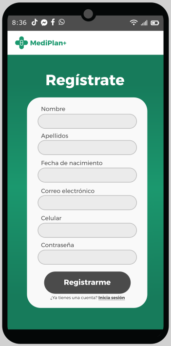

#### Iniciar sesión

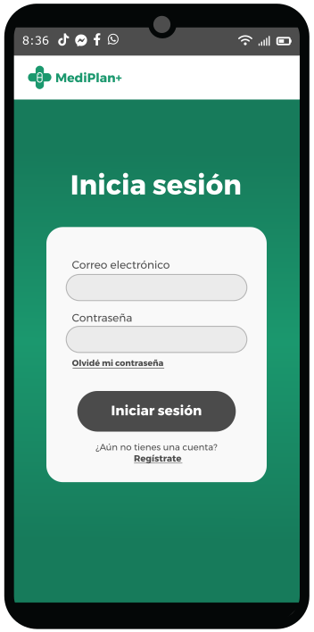

#### Recuperar contraseña

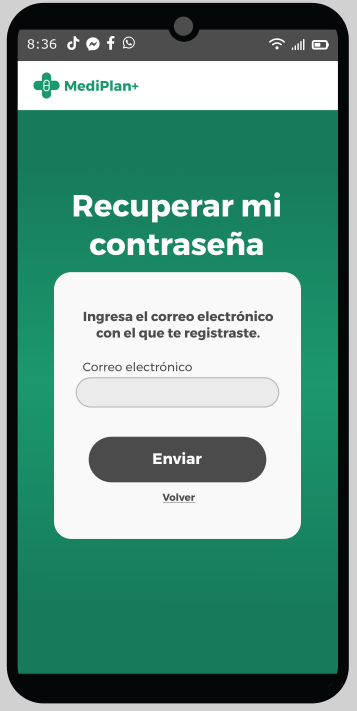  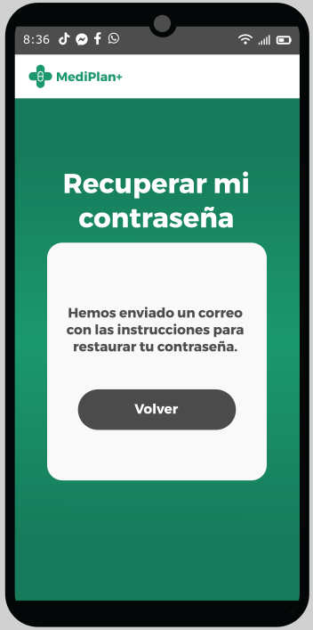

#### Ver medicamentos - Buscar medicamentos

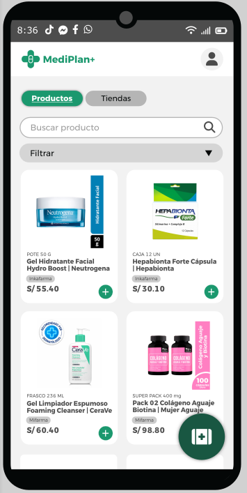


#### Filtrar medicamentos

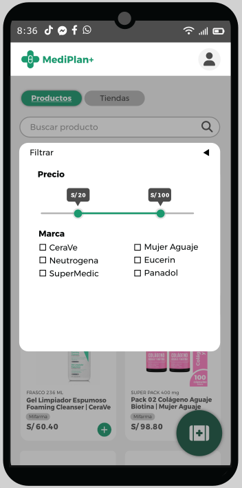


#### Detalles de producto

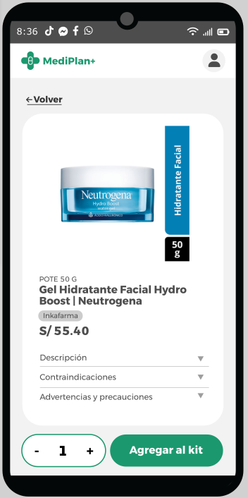


#### Ver boticas - Buscar boticas

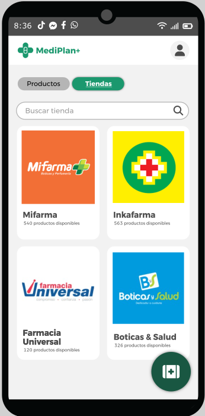


#### Buscar productos dentro de una botica

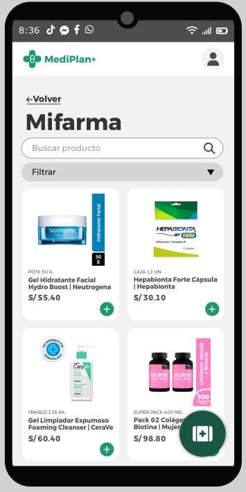  

#### Editar los medicamentos en mi kit

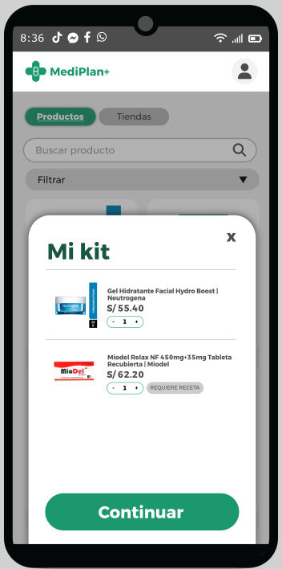  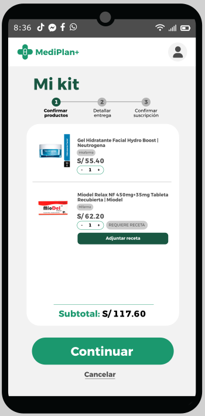


#### Subir receta médica

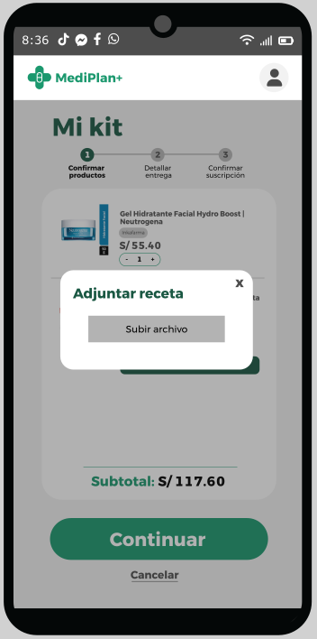


#### Suscribirme al kit

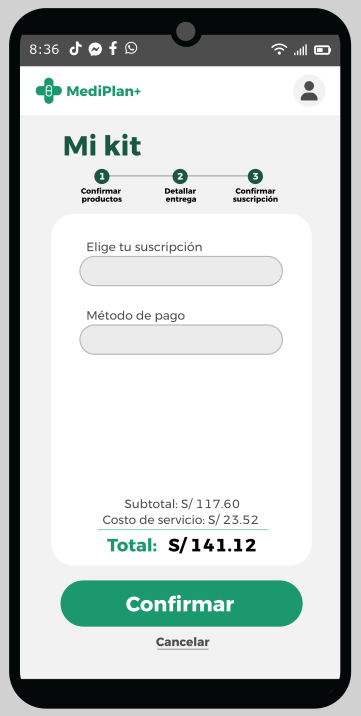  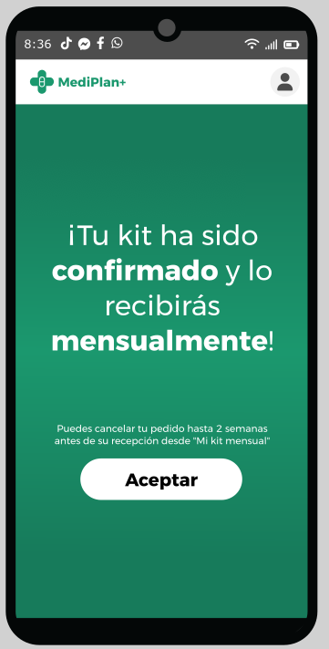


#### Cancelar mi suscripción

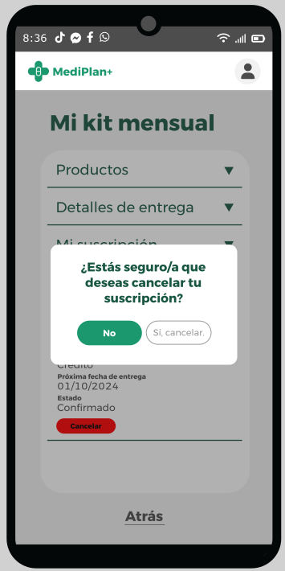


#### Ver mi perfil

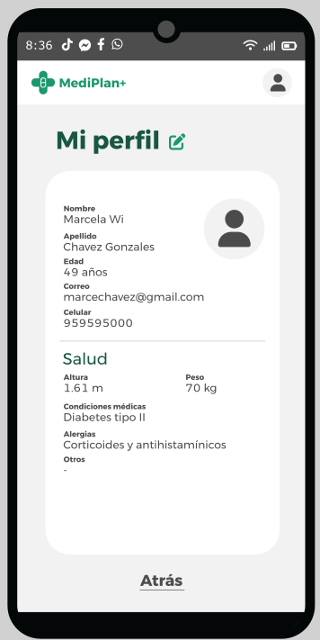


#### Editar datos personales

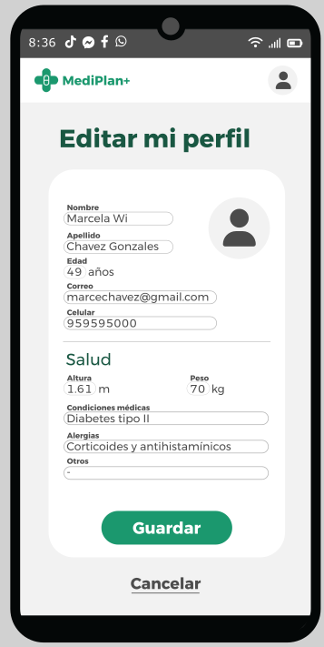


#### Ver mi kit mensual

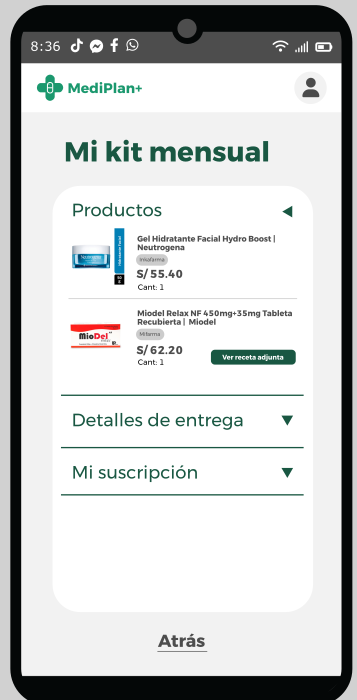


#### Rastrear pedido

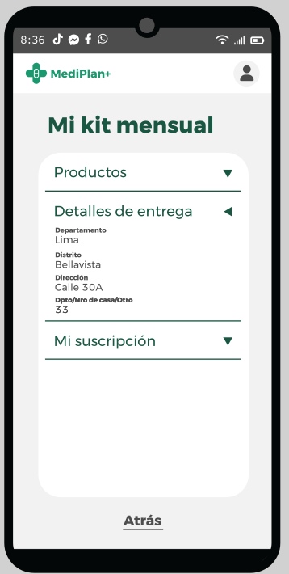  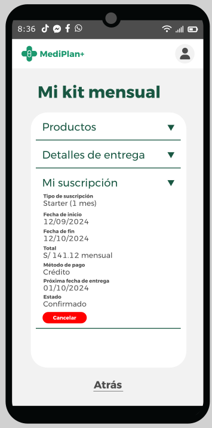


## Diagrama de base de datos


